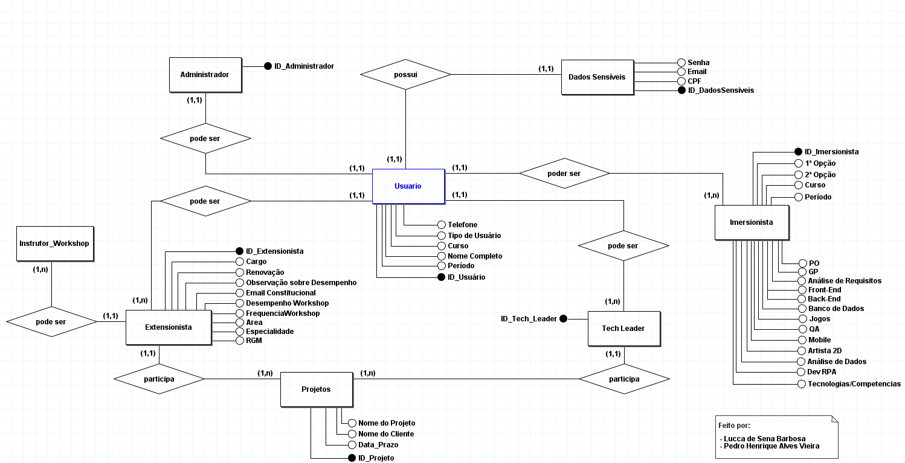
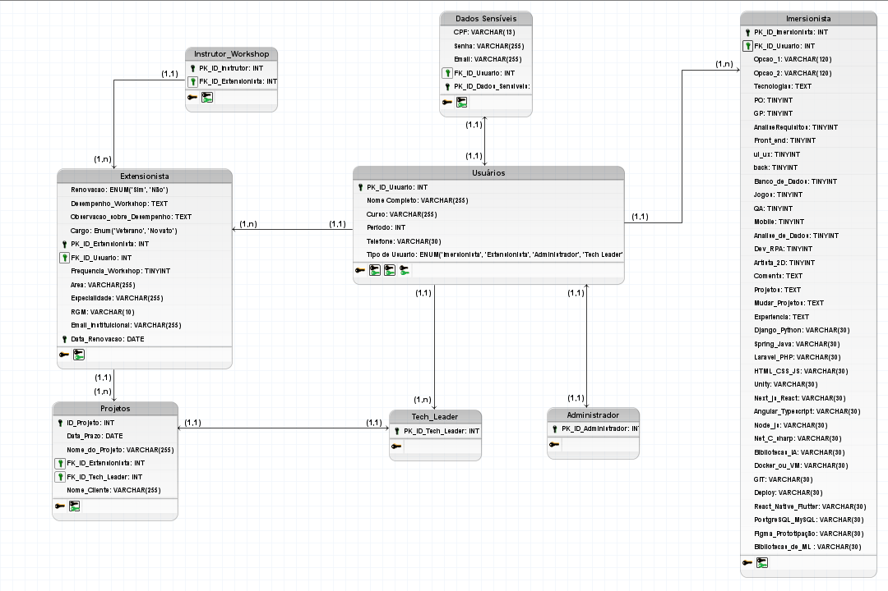
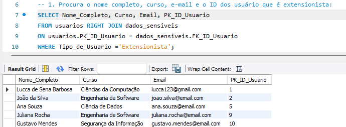
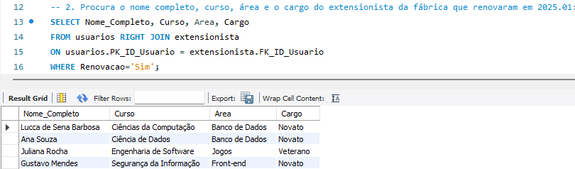
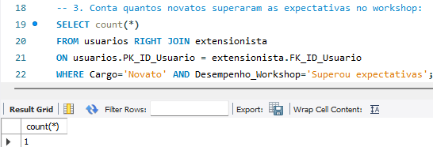

## Modelagem do Banco de Dados - F360 - 2025.01 - 🗂️

- Os arquivos serão disponibilizados abaixo, porém ainda falta ser adicionado uma documentação para que todas as variáveis sejam explicadas de maneira exata. Qualquer coisa, nós da equipe de dados estaremos a disposição para tirar qualquer dúvida até que a documentação seja finalizada. Para um melhor entendimento da nossa produção, disponibilizamos abaixo as imagens do modelo conceitual e do lógico, assim como um modelo físico que desenvolvemos para ter a certeza de que a lógica estava coerente.

### 1. Modelo Conceitual:
- Utilizamos o brModelo para sua criação

 
 

### 2. Modelo Lógico:
- Utilizamos o brModelo para sua criação

 
 

### 3. Modelo Físico:
- Utilizamos o MySQL Workbench 8.0 para implementar essa modelagem. Além da criação do Banco de dados nesse SGBD, inserimos dados criados por Inteligência Artificial para que então conseguissimos gerar "insights da fábrica" e observar na prática quais tipos de possíveis informações conseguimos reunir. Caso alguém tenha vontade de testar/criar querys, disponibilizamos a ordem em que os arquivos devem ser executados: 

<b>1. create_base.sql</b>
<b>2. inserct.sql</b>
<b>3. insights.sql</b>

#### Alguns Insights gerados: 
 
 

 
 

 
 

 
 
