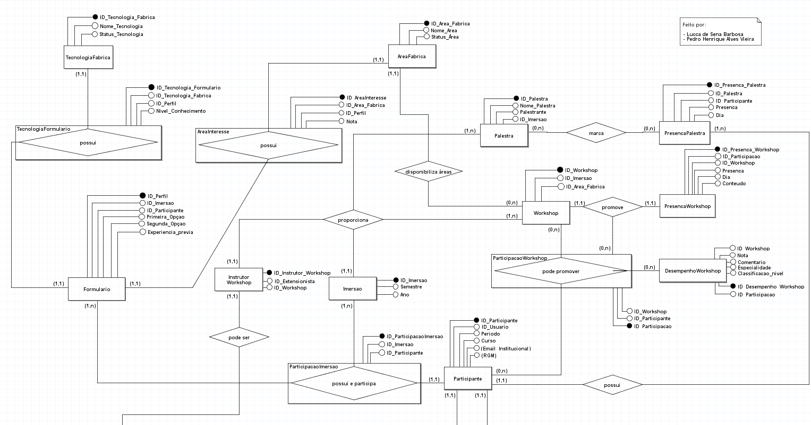

## Modelagem do Banco de Dados - F360 - 2025.01 - 🗂️

- Para um melhor entendimento da nossa produção, disponibilizamos abaixo as imagens do modelo conceitual, assim como uma documentação, explicando algumas entidades, atributos e relacionamentos:

<a href='Dicionario_de_Atributos.pdf'>Clique Aqui para ler a documentação</a>

### 1. Modelo Conceitual - Parte 1:

 
 

### 2. Modelo Conceitual - Parte 2:

 
 

<a href='Dicionario_de_Atributos.pdf'>Arquivo da modelagem no brModelo</a>

